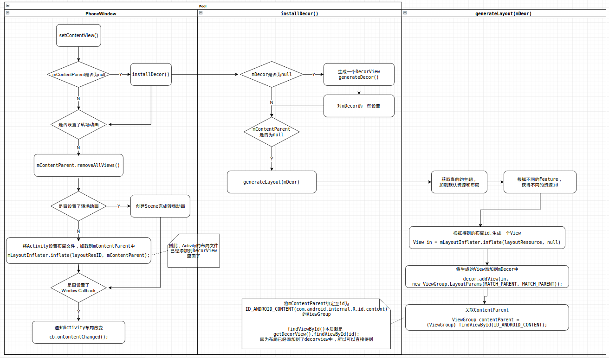
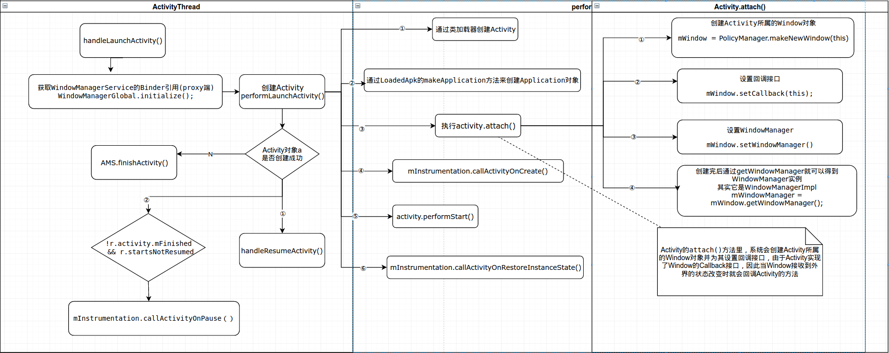
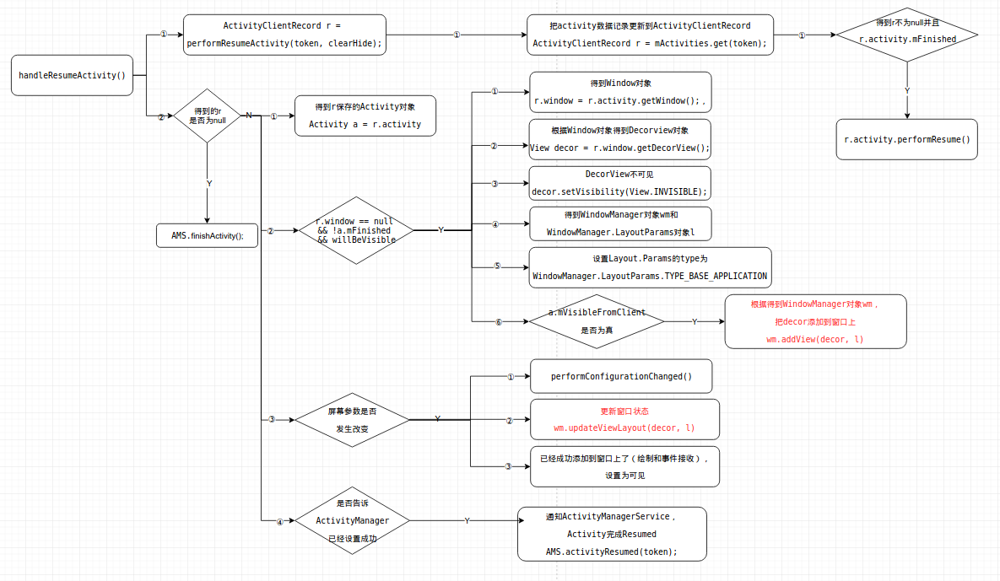
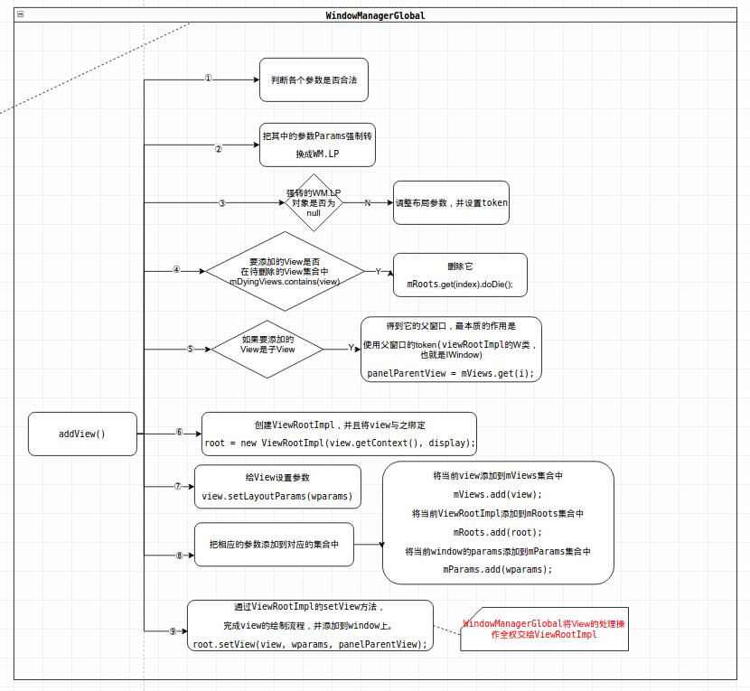
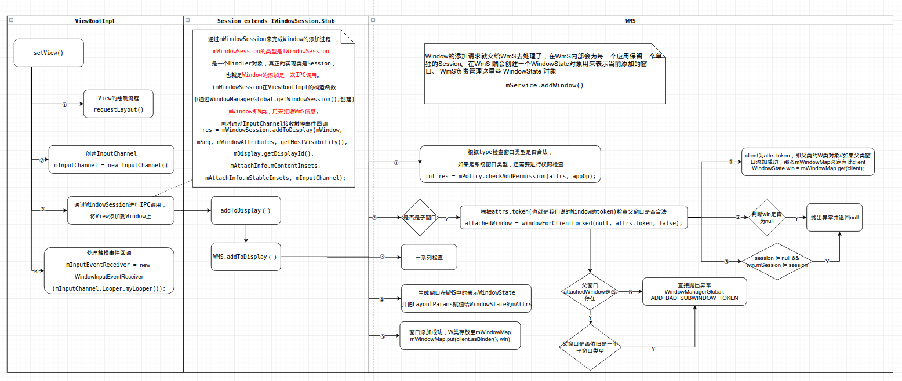

# FuckingLollipop

## PhoneWindow 的setcontentview（）流程


## ActivityThread 的handleLaunchActivity（）



## ActivityThread 的 handleResumeActivity（）



## WindowManagerGlobal 的 addView（） 方法

尽管在handleResumeActivity（）中通过WindowManager把DecorView添加到窗口上了 ，但是`wm.addView(decor, l)`，
但是WindowManager是接口，真正具体实现类是windowManagerImpl，
而在WindowManagerImplement中，对于Window(或者可以说是View)的操作都是交由WindowManagerGlobal来处理，WindowManagerGlobal以工厂的形式向外提供自己的实例。
这种工作模式是桥接模式，将所有的操作全部委托给WindowManagerGlobal来实现。
而在WindowManagerImpl的全局变量中通过单例模式初始化了WindowManagerGlobal，也就是说`一个进程就只有一个WindowManagerGlobal对象`

1. 在WindowManagerGlobal中有如下几个重要的集合
```java
    //存储所有Window对应的View
    private final ArrayList<View> mViews = new ArrayList<View>();

    //存储所有Window对应的ViewRootImpl
    private final ArrayList<ViewRootImpl> mRoots = new ArrayList<ViewRootImpl>();

    //存储所有Window对应的布局参数
    private final ArrayList<WindowManager.LayoutParams> mParams =
            new ArrayList<WindowManager.LayoutParams>();

    //存储正被删除的View对象（已经调用removeView但是还未完成删除操作的Window对象）
    private final ArraySet<View> mDyingViews = new ArraySet<View>();

```


## ViewRootImpl 的 setView（） 方法


https://drive.google.com/file/d/1rKzXAMU4RMWou38HRzxmN3AVIBVy2rWS/view?usp=sharing
